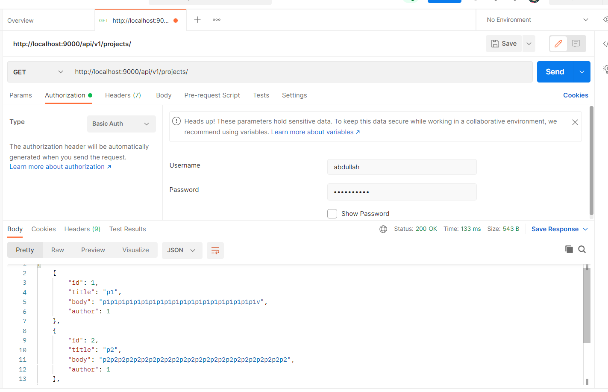
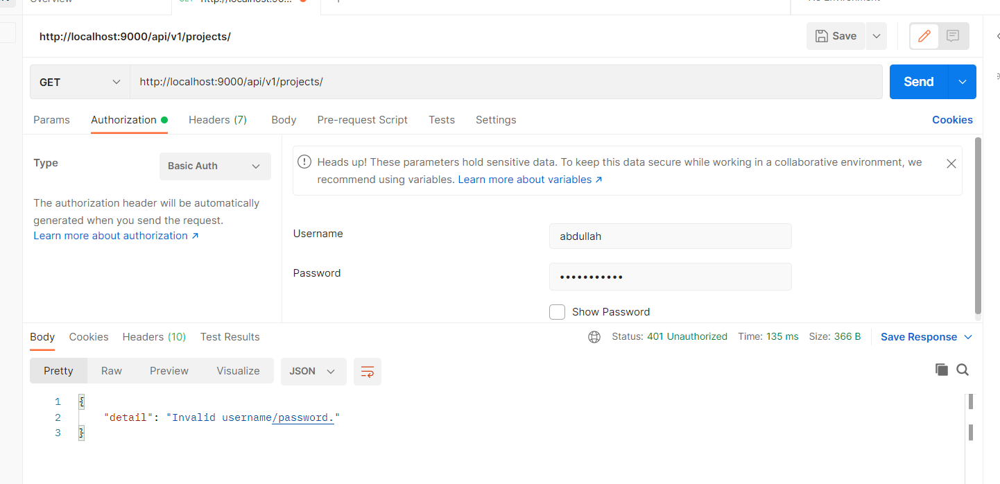
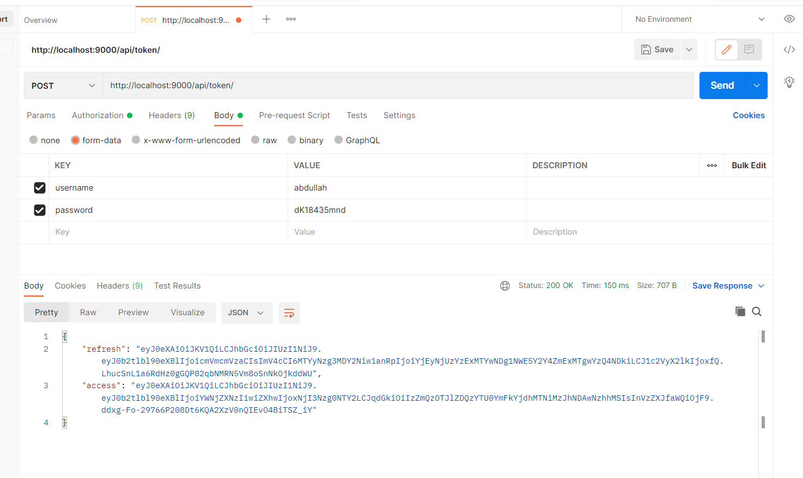
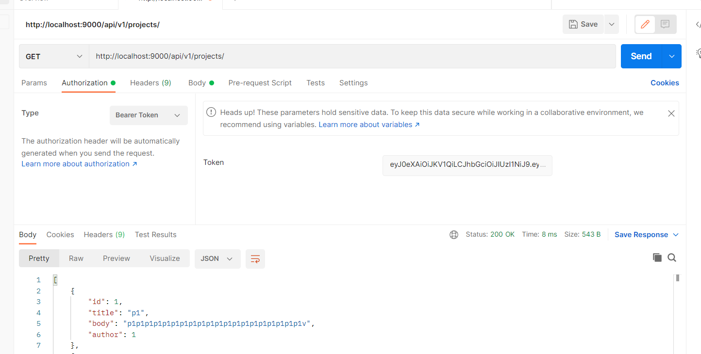

# drf-auth

Finish lab
PR:
https://github.com/Abdullah-AlSawalmeh/drf-auth/pull/1

to test using Postman you need:

1- using Basic AUTH by adding user and pass 

2- If the pass is wrong, it will give you a message 

3- to get a token

4- to use the token

